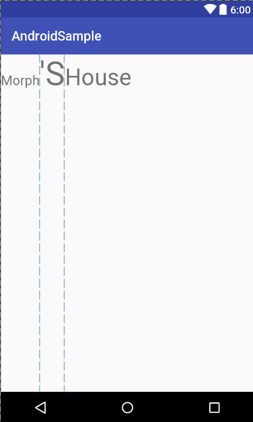
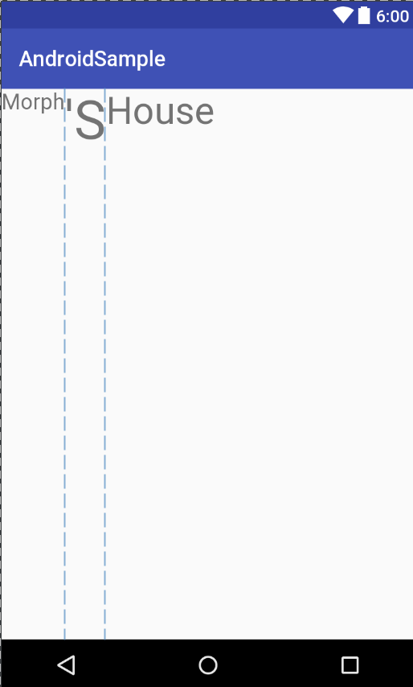

# [Android] BaselineAligned
**BaselineAlign** : LinearLayout에 포함되며 높이가 다른 Child View를 수평으로 나란히 배치할 때 아래쪽 면을 가지런히 정렬할 것(하단정렬, `true`)인지, 아닌지(상단정렬, `false`)를 지정한다. 기본값은 `true` 이다. 

이는 LinearLayout을 상속하는 TableLayout, RadioGroup, SearchView들과 TextView를 상속하는 Button, CheckBox, RadioButton, EditText 들도 해당된다.

```
<?xml version="1.0" encoding="utf-8"?>
<LinearLayout xmlns:android="http://schemas.android.com/apk/res/android"
    android:orientation="horizontal"
    android:layout_width="match_parent"
    android:layout_height="match_parent"
    android:baselineAligned="true" 	// default 값 
    >

    <TextView
        android:layout_width="wrap_content"
        android:layout_height="wrap_content"
        android:text = "Morph"
        android:textSize = "20sp"/>


    <TextView
        android:layout_width="wrap_content"
        android:layout_height="wrap_content"
        android:text = "'S"
        android:textSize = "50sp"/>


    <TextView
        android:layout_width="wrap_content"
        android:layout_height="wrap_content"
        android:text = "House"
        android:textSize = "35sp"/>
</LinearLayout>

```

`baselineAligned`속성이 default값인 true로 지정된 경우엔 아래 그림과 같이 TextView들의 값이 하단 정렬된 것을 볼 수 있다.



반면에, `baselineAligned`속성을 false로 지정해주면, 상단으로 정렬시킬 수 있다. 

