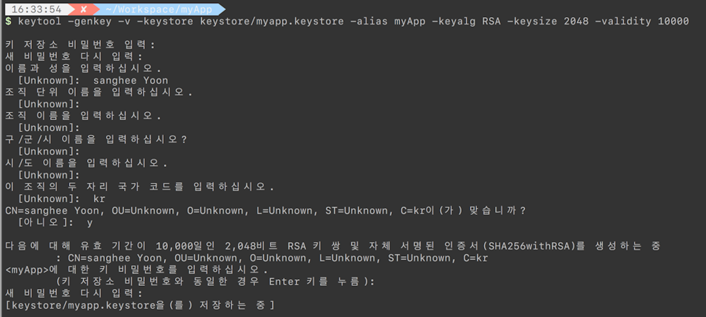
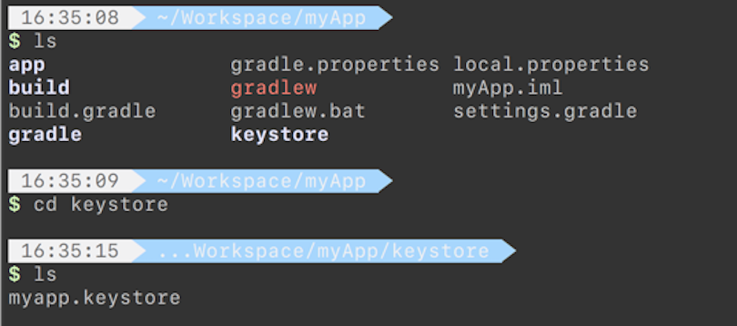
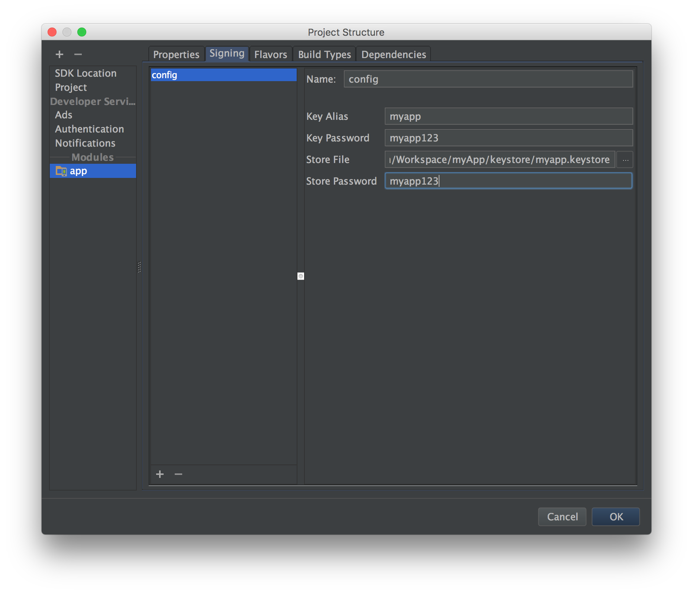

# Android KeyStore
제작한 Android 앱을 구글 플레이 스토어와 같은 스토어에 올려서 배포 하기 위해서는 반드시 개발자의 `KeyStore` 파일을 이용한 서명(signing)을 해야한다.(릴리즈 빌드된 APK 파일을 만들어야 한다.) 서명은 앱의 개발자임을 증명하는 아주 중요한 수단이다. 때문에 한 번 서명한 KeyStore 파일은 계속 백업 후 유지해야 한다. 같은 패키지명을 사용한다 하더라도 서명이 다르면 그 앱은 업데이트 되지 않는다. 기본적으로 Google PlayStore에 앱 업데이트로 게시되지 않는다. 그래서 서명 파일을 생성 시 그 유효기간을 앱의 예상 사용시간보다 조금 길게 유지하는 것이 좋다. 구글에서는 25년 이상을 권장한다.


## Debug vs Release
제작한 앱을 구글 플레이 스토어와 같은 스토어에 올려서 배포하기 위해서는 릴리즈 모드용 keystore 를 생성해서 이 keystore로 signing해야 한다. 키 signing을 하기 위해서는 JDK의 keytool 유틸을 이용한다.
우리가 일반적으로 개발할 때 사용하는 빌드 설정은 디버그 빌드이다. 디버그용 keystore는 안드로이드 SDK를 설치할 때 같이 생성된다. `debug.keystore`라는 파일 이름으로 생성되어 있다. 디버그용 keystore은 그냥 사용하면 되는데, 한 가지 유의해야 할 점은 유효기간이 365일 밖에 되지 않는다는 점이다. 만약 365일이 지나서 디버그용 keystore와 관련된 에러가 발생한다면 디버그용 keystore를 지우고 다시 빌드하면 된다.

디버그 빌드와 릴리즈 빌드의 차이점은 릴리즈 빌드는 개발자의 고유 인증서로 서명한다는 것과(디버그 인증 서명은 개발툴에서 알아서 해준다.) 

릴리즈 빌드에 사용하는 개발자의 고유 인증서는 생성하고 사용한 후 절대로 잃어 버리면 안된다. iOS와는 달리 고유 인증서를 잃어 버리면, 다시는 해당 앱의 업데이트 버전을 만들 수 없게 된다.(새로 인증서를 만들게 되면 완전히 다른 앱으로 취급된다.)

## 릴리즈 모드용 안드로이드 KeyStore 생성 방법
1. keystore 디렉토리 생성

2. 기본 Command
```
$ keytool -genkey -v -keystore <keystore name> -alias <alias name> -keyalg <alg name> -keysize <key size> -validity <validity days>

```

> `-keystore` : keystore가 저장될 위치
 `-alias` : key 자체 이름
 `-keyalg` : 키 암호화 알고리즘, RSA나 DSA중 하나를 선택한다
 `-keysize` : 키의 크기. 이 옵션을 빼면 기본적으로 1024비트의 크기로 저장한다. 구글에서는 2048비트 이상의 키 크기를 권장
 `-validity` : 유효기간. 단위는 일수이다. 구글에서는 최소 25년 이상(9125일)의 유효기간을 입력할 것을 권장한다. 10000일 정도로 해주면 적당하다.

예를 들어 keystore 디렉토리에 "myapp.keystore"라는 이름으로 RSA알고리즘을 적용, 키 크기를 2048비트, 유효기간을 10000일, 키 이름을 "myapp"라고 만든다면 아래와 같이 입력한다.

```
$ keytool -genkey -v -keystore keystore/myapp.keystore -alias myapp -keyalg RSA -keysize 2048 -validity 10000
```
어플리케이션마다 다른 키를 적용할 필요는 없다. 하나의 키로 여러개의 어플리케이션에 signing을 할 수 있다.

3. 기본 Command 실행 후 출력 화면 및 프로세스



4. 키 생성 확인
다음과 같이 keystore 디렉토리에 키가 생성된 것을 확인할 수가 있다.


5. 생성한 keystore signing하기
signing은 Android Studio 에서 App의 Project Structure에서 Singing을 해주면 된다. 생성한 key Alias 와 Password 를 알맞게 입력하고 생성한 keystore파일에 대한 경로와 store password 를 올바르게 입력하면 `app.build.gradle` 에 `signingCofig` 가 추가된다.
단, 주의할 점은 `storeFile` 의 경로를 절대경로에서 상대경로로 반드시 바꾸어주어야 한다.


```
signingConfigs {
        config {
            keyAlias 'myapp'
            keyPassword 'myapp123'
            storeFile file('../keystore/myapp.keystore')
            storePassword 'myapp123'
        }
    }
```

6. app.build.gradle 파일에 정보 추가
  - buildTypes 안에 디버그/릴리즈 일때 정보 추가 
```
  buildTypes {
        debug {
            signingConfig signingConfigs.keystore
        }

        release {
            minifyEnabled false
            signingConfig signingConfigs.keystore
            proguardFiles getDefaultProguardFile('proguard-android.txt'), 'proguard-rules.pro'
        }
    }
```

### Keytool Option

Keytool Option|Description
--------------|-------------
`-genkey` | Generate a key pair(public and private keys)
`-v` | Enable verbose output.
`-alias <alias_name>` (별칭) | An alias for the key. Only the first 8 characters of the alias are used.
`-keyalg <alg>` (키 알고리즘) | The encryption algorithm to use when generating the key. Both DSA and RSA are supported.
`-keysize <size>` (키 사이즈) | The size of each generated key (bits). If not supplied, Keytool uses a default key size of 1024 bits. In general, we recommend using a key size of 2048 bits or higher.
`-dname <name>` (대상 이름) | A Distinguished Name that describes who created the key. The value is used as the issuer and subject fields in the self-signed certificate. Note that you do not need to specify this option in the command line. If not supplied, Jarsigner prompts you to enter each of the Distinguished Name fields (CN, OU, and so on).
`-keypass <password>` | The password for the key. As a security precaution, do not include this option in your command line. If not supplied, Keytool prompts you to enter the password. In this way, your password is not stored in your shell history.
`-validity <valdays>` (유효기간) | The validity period for the key, in days. Note: A value of 10000 or greater is recommended.
`-keystore <keystore-name>.keystore` (키 저장소) | A name for the keystore containing the private key.
`-storepass <password>` | A password for the keystore. As a security precaution, do not include this option in your command line. If not supplied, Keytool prompts you to enter the password. In this way, your password is not stored in your shell history.


### 기존 keystore정보 보기
구글 API를 신청할 때, SHA1의 인증지문(fingerprint)를 요구한다. 
```
$ keytool -v -list -keystore <keystore path>
```
를 입력하면 MD5와 SHA1의 인증 지문이 나온다. JDK7부터는 위의 keytool 명령어에 `-v`를 안붙이면 MD5인증지문이 안나오고 SHA1의 인증지문만 나온다. JDK7부터는 기본 인증지문이 MD5에서 SHA1으로 변경되었기 때문이다.


