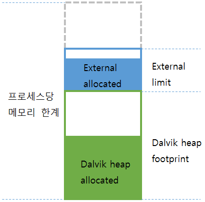

# Android 앱 메모리 최적화
Android 앱을 개발하다 보면 메모리 부족 문제에 시달리기 쉽다. 특히, 비트맵 이미지를 로딩하다가 다음과 같이 OOM(out of memory)이 발생하는 경우가 흔하다.
```
java.lang.OutOfMemoryError: bitmap size exceeds VM budget  
```

이는 비트맵 이미지의 크기가 VM(virtual machine)메모리의 한계를 초과했다는 것인데, 인터넷에서 이를 위한 해결책으로 `recycle()`메소드의 사용을 권하지만 그 이유에 대한 상세한 설명은 찾아보기 힘들다. 

이로 인해 'Android 프레임워크의 비트맵 자체에 leak 가 있다'는 오해가 밑도 끝도 없이 나오고 있다. 그래서 대체 비트맵에 대해 어떠한 오해가 있으며 이를 어떻게 해결할 수 있을지 풀어보면서 Android의 메모리 부족 문제와 해결 방법을 살펴 보도록 할 것이다. 

## Android 메모리 모델
Android의 메모리 모델은 운영체제의 버전에 따라 Honeycomb(Android 3.0)미만의 메모리 모델과 Honeycomb 이상의 메모리 모델, 두 가지로 나뉜다. 먼저 Honeycomb 미만의 메모리 모델을 살펴보자.



- dalvik heap 영역은 Java 객체를 저장하는 메모리이다.
- external 영역은 native heap의 일종으로서 네이티브 비트맵 객체를 저장하는 메모리이다.
- dalvik heap 영역과 external 영역은 각각 프로세스당 메모리 한계까지 확장될 수 있다.
- dalvik heap 영역과 external 영역의 dalvik heap footprint와 external limit를 합쳐서 프로세스당 메모리 한계를 초과하면 OOM(Out Of Memory)이 발생한다.
- external limit는 external allocated와 일정한 간격을 유지하면서 줄어들거나 늘어나지만, dalvik heap footprint는 증가하기만 할 뿐 절대 감소하지 않는다는 특성이 있다.

> **참고** 비트맵은 Java 비트맵 객체와 네이티브 비트맵 객체로 나뉜다. Java 비트맵 객체는 실제 비트맵 픽셀 데이터를 담고 있는 네이티브 비트맵 객체를 가리키는 껍데기일 뿐이다.

external 영역은 native heap이라고 생각하면 된다. native heap은 Linux 커널(kernel)에서 관리하는 메모리로서 단말기에 장착된 물리적인 메모리 용량 전체까지 할당받을 수 있다. C/C++과 같은 언어를 이용해 네이티브 프로그래밍을 할 때 사용한다. dalvik heap 영역은 Android용 Java 가상 머신(dalvik VM)에 의해 할당되는 Java용 메모리이다.

Honeycomb부터는 네이티브 비트맵 객체를 저장하기 위한 external 영역을 없애고 dalvik heap만 남겼다. 비트맵 픽셀 데이터 자체도 dalvik heap 영역에 저장하게 된다. 

이와 같은 프로세스당 메모리를 애플리케이션 메모리 또는 앱 메모리라고 한다. 이 메모리의 크기는 단말기별로 다양한데, 보통 단말기의 화면 크기와 밀도가 커질수록 더 커진다. 화면이 커질수록 화면을 꽉 채우려면 비트맵 이미지의 크기가 더 커져야 하기 때문이다. 최초의 Android 폰인 HTC G1이 앱 메모리는 16MB였다. 현재 단말기의 앱 메모리는 24MB, 32MB, 48MB, 64MB, 96MB, 128MB 등 다양하다.
