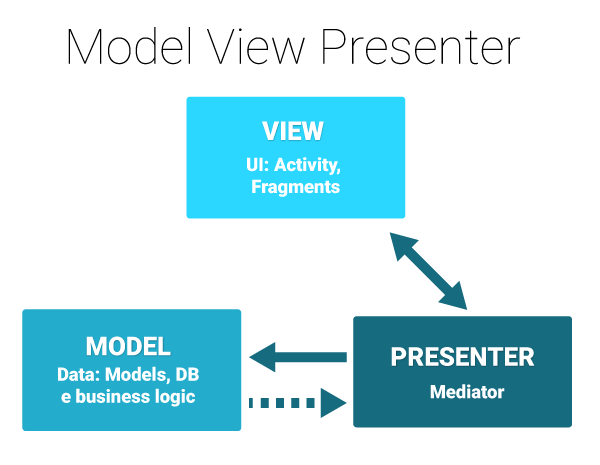

# MVP
MVP 패턴은 1990년대 초기에 마이크로소프트에서 공개한 패턴이다. MVC 패턴을 기반으로 둔 GUI를 처리하기 위한 패턴이다. 다시 말하면, MVC 패턴 중 하나가 MVP가 된다 한다. MVC와는 다르게 MVP는 Model과 View간의 결합도를 낮추는데 초점이 맞추어져 있다. MVP는 컨트롤러의 책임에 묶이지 않고도 뷰와 액티비티가 자연스럽게 결합하도록 한다.

### MVP의 동작

* View에서 이벤트 발생
* Presenter에 넘겨서 처리
* Data가 필요한 경우 Model에서 처리하고, 결과를 Presenter를 이용하여 View에 전달 

## 모델(Model)
MVC와 동일하며 변화가 없다.

## 뷰(View)
MVC에 대비하여 유일한 변화는 액티비티/프래그먼트가 이제 뷰의 일부로 간주된다는 것이다. 따라서 이들이 서로에게 연관되는 자연스러운 현상을 극복할 필요가 없다. 액티비티가 뷰 인터페이스를 구현해서 프리젠터가 코드를 만들 인터페이스를 갖도록 하는 것이 좋다. 이렇게 하면 특정 뷰와 결합되지 않고 가상 뷰를 구현해서 간단한 유닛 테스트를 실행할 수 있다.

## 프리젠터(Presenter)
본질적으로는 MVC의 컨트롤러와 같지만, 뷰에 연결되는 것이 아니라 그냥 인터페이스라는 점이 다르다. 이에 따라 MVC가 가진 테스트 가능성 문제와 함께 모듈화/유연성 문제 역시 해결한다. 사실 극단적으로 MVP를 따르는 사람들은 프리젠터가 절대로 어떤 안드로이드 API나 코드라도 참조해서는 안된다고 주장한다.

## 프리젠터 문제점
* 유지 보수 - 컨트롤러처럼 프리젠터에도 시간이 지남에 따라 추가 비즈니스 로직이 모이는 경향이 있다. 시간이 흐른 후 개발자는 거대하고 다루기 어려운데다 문제가 발생하기 쉽고 분리하기도 어려운 프리젠터를 발견하게 된다.

물론 신중한 개발자라면 세월에 따른 앱의 변화에 맞춰 이 문제를 지속적으로 해결해나갈 수 있을 것이다. 하지만 MVVM은 시작할 때부터 이 문제를 해결하도록 도움을 줄 수 있다.

## MVP를 안드로이드에 적용하려는 이유 
* TDD(Test Driven Development)의 가능성
* View와 Model간의 구분이 가능
* View와 Model의 사용법이 분리되면서 깔끔한 코드 작성이 가능

