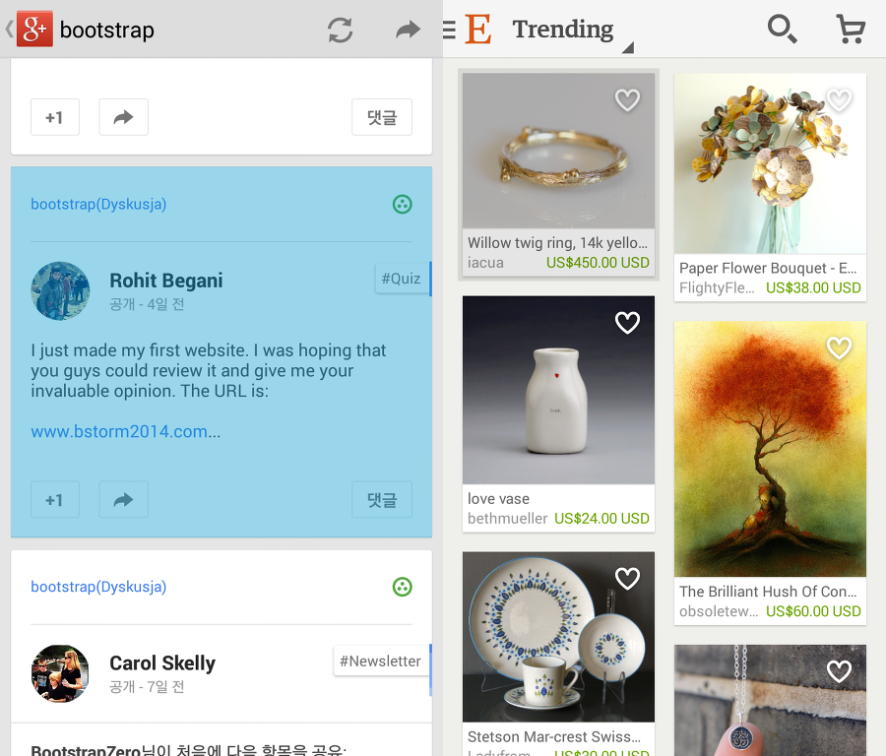

#[Android] 사용자 터치 Pressed에 대한 처리 방법
모바일 앱 특히 안드로이드 앱에서는 사용자의 액션에 대해 즉각적인 피드백이 필요하다. 이러한 피드백은 안드로이드의 Selector를 통해 쉽게 구현이 가능하다. Selector는 특정 상태에 따라 설정한 Color값이나 Drawable로 변경해주는 안드로이드만의 가장 강력한 기능이다.
보통 안드로이드의 Pressed에 대한 처리는 레이아웃이나 뷰에서 Background의 Selector기능을 가진 Drawable로 처리하게 된다. Background로 처리하게 되면 레이아웃의 자식뷰들은 Selector의 색상이 가려져 뒷배경만 바뀌어 보이지 않게 된다. 자식뷰가 레이아웃과 동일한 크기를 가지는 경우에는 거의 표시 되지 않는것과 다름이 없을 정도로 눈에 보이지 않을 수 있다. 

### 해결방법
해결방법은 Background가 아닌 Foreground처리를 하는 것이다. 즉, 배경이 아니라 위쪽을 덮어버리면 된다. 다행히도 안드로이드에서는 레이아웃 속성에 `android:foreground`를 제공해준다. 또한 불행하게도 FrameLayout만 해당속성이 작동되며 가장많이 쓰는 LinearLayout외 다른 레이아웃들은 작동하지 않는다. LinearLayout에는 `android:foreground`속성이 구현되어 있지 않아 직접 구현해야 한다. ([ForegroundLinearLayout](https://gist.github.com/chrisbanes/9091754)참고)

```
<ForegroundLinearLayout
    android:layout_width="match_parent"
    android:layout_height="wrap_content"
    android:foreground="?android:selectableItemBackground">

    <ImageView
        android:id=”@+id/imageview_opaque”
        android:layout_width="match_parent"
        android:layout_height="wrap_content" />

    ... other views ...

</ForegroundLinearLayout>
```


Foreground 사용을 가장 잘 보여주는 구글플러스와 E-Trending앱이다. 이렇게 Foreground를 사용하면 가장 명확하게 사용자 반응에 대한 피드백을 전달할 수 있다. 
ListView, GridView의 경우 보통 아이템의 뷰에서 Background를 처리하는 경우가 많은데 `android:listSelector`속성을 통해 Drawable를 설정하고, `android:drawSelectorOnTop = 'true'`속성을 설정해 Foreground처리가 가능하다. 