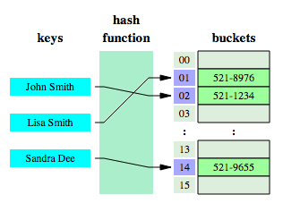
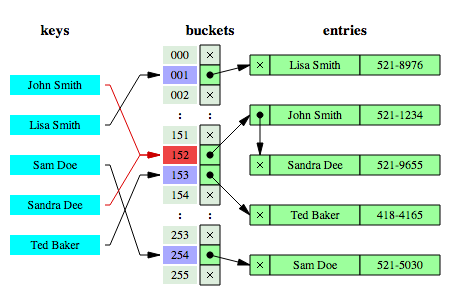
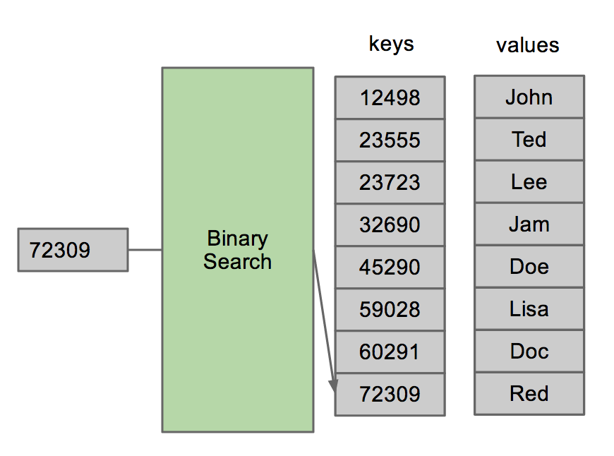

# SparseArray
Android 프로그래밍을 하다보면 `Map<Integer, Object>`를 사용하게 될 때, `SparseArray`가 더욱 좋은 Performance를 가지고 있으니 바꾸라는 Lint가 뜨는 것을 볼 수 있을 것이다. 그렇다면 SparseArray는 무엇일까?

안드로이드 API version 1 부터 제공되었으며, JAVA가 아닌, Android문법으로 만들어졌다. Sparse의 의미는 "뜨문뜨문 떨어져있는"을 의미한다.

위키에 따르면, `Map<Integer, Object>`를 사용하는 이유는 `put<key, value>`를 넣고 `get(key)`를 통해 value를 가져오기 위함이다. 이 때 주로 key값에는 `value.hashcode()`를 사용하게 되며, 아래 그림과 같이 사용할 수 있다. 


하지만, 같은 id 값을 가지는 경우도 종종 생기며, 이럴 경우 **Hash Collision**이 발생한다. 


이러한 이유 때문에, HashMap에는 **changin**이란 기법을 사용해 key를 통해 가져온 값이 "Sam Doe"와 맞는지 아닌지를 체크해서 정확한 값을 가져오는 번거로움이 있다. 

그렇다면 SparseArray는 무엇이 다를까, Sparse란 의미가 "데이터로 뜨문뜨문"이란 의미라고 했는데, 데이터 구조가 위쪽 컬럼은 뜨문뜨문 비어있는 컬럼이고, 아래쪽은 데이터가 빼곡하게 저장되어 있는 경우를 의미한다고 한다. 안드로이드에서 integer 1~100까지는 비어있고 101~200까지는 데이터가 있는 경우, 이런경우를 대비해 만든 것이 SparseArray이다.


HashMap과 같이 hash function을 따로 사용할 필요가 없고, HashMap은 java.lang.integer가 계속 생성되는 반면, SparseArray는 int[]로 객체가 생성되지 않는 것이 Performance가 높아지는 이유 중 하나라고 한다. 

SparseArray를 HashMap처럼 사용하기 위해서는 아래와 같이 사용하면 된다. 
```
SparseArray sparseArr = new SparseArray();
sparseArr.append(key, value);
sparseArr.get(key)
```