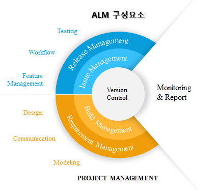

# ALM(Application Lifecycle Management)

## ALM
ALM이란 Application Lifecycle Management로 소프트웨어 개발의 전반적인 관리를 자동화된 툴을 이용하여 관리하는 것을 말한다. 즉, 여기서 말하는 관리는 요구 사항, 아키텍처, 릴리즈, 테스트, 이슈, 버그에 대한 관리 등을 포함한다. 그렇기 때문에 ALM은 현재 많은 업체들이 사용하는 개념이다. 

ALM 이전의 소프트웨어 개발 프로세스는 요구 사항 관리에 대한 문서나 시스템, 코드 관리, 일정 관리 등등이 각기 다른 제품과 다른 프로세스, 다른 템플릿으로 구현 되어 왔었고, 이로 인해 소프트웨어 개발 과정에 대한 개념이 실제로 구현되었을 때는 단계별로의 추적성과 관리에 대한 실용성이 떨어졌던게 사실이다. ALM은 이러한 기존의 소프트웨어 개발 프로세스를 개선한다. 

아래의 그림에서 볼 수 있듯이 ALM은 크게 릴리즈, 이슈, 빌드, 요구사항 관리 영역을 커버하고 있다는 것을 볼 수 있다. 

[그림 출처 - REDMINE & Jenkins 커뮤니티](http://www.redmine.or.kr/projects/pjt_demo)

ALM은 요구 사항 관리, 프로젝트 스케쥴 관리를 위한 Task관리, 빌드 환경 자동화 및 형상 관리, 테스트 자동화 부분이 가장 핵심 부분이라 할 수 있다. 그외에 Design같은 경우는 프로세스를 정형화 시키기 어렵기도 하고, 실제 프로젝트에서는 Desi;gn이 프로젝트가 진행되어감에 따라 변화하고 완성되어 가기 떄문에 Design을 ALM 에 포함시키는 것은 쉽지 않다.

> 사람들은 프로젝트를 하면서 똑똑해지고 시스템은 프로젝트가 진행됨에 따라 명확해 진다. Agile 사상에서도 Design은 선행 작업이 아니라, 주로 프로젝트 진행과 같이 가는 **On going** 작업으로 정의하고 있다. Design을 ALM의 구현체 내에 포함시키기 위해서는 말단 개발자까지 상당 수준의 성숙도가 필요하다. 

### 문제점
ALM의 사상적인 출발은 툴을 이용한 소프트웨어 개발 프로세스의 현실화인데, 시장에 있는 툴의 경우 성숙도가 높아서 프로젝트에 적용하는데 상당한 경험과 지식을 요구한다. 실용적인 면에서 생각했을 때 ALM의 적용 범위는 개발자의 수준에 상관없이 적용 되어야 하기 때문에 현실적인 측면에서는 실제 프로젝트에 적용하기가 어려운 점이 많다.

## VCS(Version Control System)
VCS는 소스 코드 이력 관리에 대한 시스템으로 소스파일에 대한 변화를 시간에 따라 기록했다가 이후에 특정 시점의 버전을 다시 꺼내올 수 있는 시스템을 말한다. 동일한 정보에 대한 여러 버전을 관리하게 되며, 그 버전을 통해서 시간적으로 변경 사항과 그것을 작성한 작업자를 추적할 수 있다. 

VCS는 다음과 같이 세 가지 유형으로 나뉘어 진다.

* Local VCS (로컬 버전 관리 시스템)
* Centralized VCS - CVCS (중앙집중식 버전 관리 시스템)
* Distributed VCS - DVCS (분산 버전 관리 시스템)
### Local VCS
간단한 데이터베이스를 사용하여 파일의 변경 정보를 관리한다.

### Centralized VCS - CVCS
프로젝트를 진행할 때 다른 개발자와 함께 작업해야 하는 경우 사용되는 시스템이다. 파일을 관리하는 서버가 별도로 있고, 클라이언트가 중앙 서버에서 파일을 받아(Checkout) 사용할 수 있다. `CVS`와 `SVN`, `Perforce`가 대표적인 CVCS 이다.

CVCS 는 관리자가 프로젝트에 참여한 사람들의 작업 리스트 정보를 관리하기가 쉽다. 하지만 중앙 서버에 문제가 발생하여 다운될 경우, 그동안에는 협업 및 백업이 불가능하다. 또한 하드디스크에 문제가 생긴다면 프로젝트의 모든 히스토리를 잃을 수도 있다는 단점이 있다. 

 
### Distributed VCS - DVCS
클라이언트가 저장소 자체를 복제(clone)한다. 서버에 문제가 생길 경우 이 복제물로 작업이 가능하며 서버를 복원할 수도 있다. 또한 remote 저장소가 존재하며 remote 저장소가 많을 수도 있다. 즉, 동시에 다양한 그룹과 다양한 방법으로 협업이 가능하다. 대표적으로 `Git`, `Mercurial`가 DVCS 이다.

