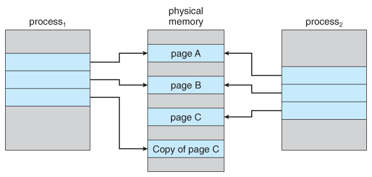

# Copy-On-Write (COW)
	- 작성시 이전의 내용을 Copy 한다
	- 한정된 Resource를 서로 다른 두 개의 프로세서가 공유할 때 유용하게 사용

	- 공유되고 있는 Resource 를 하나의 프로세서가 수정해야 될 경우가 발생할 때 Resource의 복사본을 쓰게끔 한다 

	[Single Thread 에서는 Copy 와 Write 가 한 번에 이루어 질 수 없기 때문에 mutex 로 따로 수행함]

### OS 에서의 COW - `fork()`

	fork() 로 process2 는 process1 의 child process 가 되면, 아래 그림과 같이 같은 영역의 resource 를 공유하게 된다. 
	이 상태에서 process1 이나 process2 가 resource 를 수정하는 경우가 발생하면 
	Figure_2 처럼 Copy Of page C 를 process1 이 점유하고 
	이에 대한 포인터도 기존의 pageC 를 가리키던 포인터를 Copy of page C 로 변경하면 COW 가 적용된 상태가 되는 것이다.

