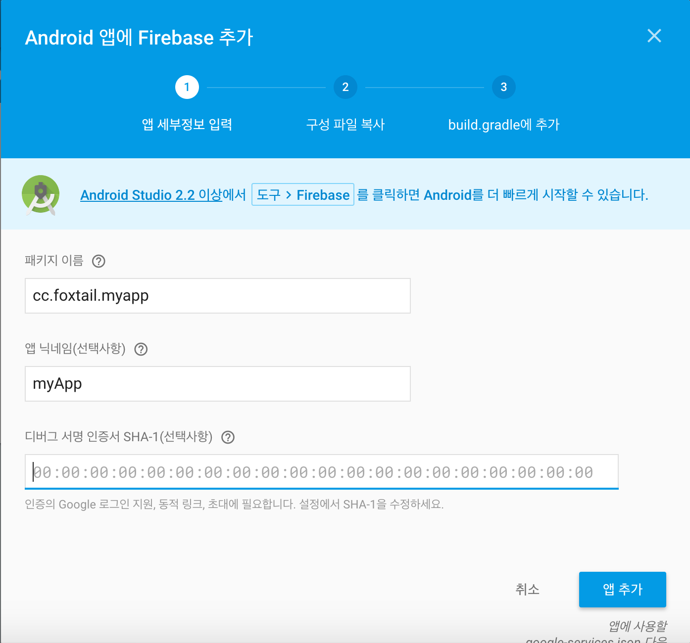
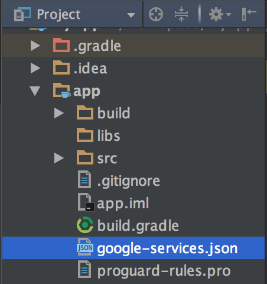

# Firebase 설정 및 라이브러리 의존성 설정

## Firebase 프로젝트 생성하기
Android 앱에서 Firebase를 추가하기 위해서는 먼저, [Firebase 홈페이지](https://www.firebase.com/)에 들어가 프로젝트를 생성해 주어야 한다. 

프로젝트를 만들고나서 `Android 앱에 Firebase를 추가`를 클릭해서 다음과 같은 창을 띄운다. 알맞은 패키지 이름과 앱 이름에 대한 정보를 올바르게 입력한다. 앱이 Google 로그인, 동적 링크, 초대를 사용하려면 디버그 서명 인증서 `SHA-1`을 추가적으로 입력한다. 



SHA-1의 인증지문(fingerprint)를 알아내기 위해서는 아래의 명령어를 통해 알 수 있다. 
```
$ keytool -v -list -keystore <keystore path>
```

필요한 정보를 모두 입력한 후에, 앱 추가를 클릭하고 `google-services.json`파일을 다운로드 받는다. 그리고 Android Studio로 넘어와 안드로이드 프로젝트를 생성해서 진행한다. 등록한 패키지명과 같은 안드로이드 프로젝트를 생성한 후, app폴더 안에 다운로드 받은 `google-service.json`파일을 넣어준다. 



그런 다음 Project의 `build.gradle`에 다음과 같이 추가해준다. 
```
...
dependencies {
    classpath 'com.google.gms:google-services:3.0.0'
}
...
```

App의 `build.gradle`파일에는 다음과 같이 추가한다.
```
apply plugin: 'com.google.gms.google-services'
...
dependencies {
    compile 'com.google.firebase:firebase-auth:9.8.0'
    compile 'com.firebaseui:firebase-ui-auth:0.6.2'
}
...
```

