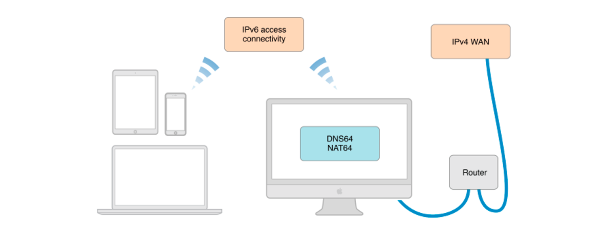

# Apple's IPv6
`Supporting IPv6 in iOS 9` 에서 발표한 Apple의 개발 뉴스에서는 IPv6-only network service가 지원되어야 한다는 정책을 발표하였고, 2016년 초부터 해당 사항을 앱 리뷰 시에 적용한다고 하였다. 

## IPv6 란
주소의 길이가 128bit로 급격하게 늘어나는 인터넷 연결 기기와 이에 따른 IPv4 주소의 고갈에 대응하여 제안되었다. IPv6는 기존 IPv4와의 호환성을 최대한 유지할 수 있는 방향으로 설계되어, 대부분의 기존 프로토콜의 수정 없이 동작 가능할 수 있다. 

### 주소 표현 방법
주소의 표현은 128bit의 주소공간으로써 다음과 같이 16bit(2octet)를 16진수로 표현하여 8자리로 구성한다.

```
2001:0db8:85a3:0000:0000:8a2e:0370:7334
```

위의 Address Literal은 아래와 같이 표현할 수 있다. 0000 은 0으로 축약할 수 있으며, 아래와 같이 간단하게 생략할 수도 있다.
```
2001:0db8:85a3:8a2e:0370:7334
```

### IPv6의 특성
* IP 주소의 확장: IPv4의 기존 32 비트 주소공간에서 벗어나, IPv6는 128 비트 주소공간을 제공한다.
* 호스트 주소 자동 설정: IPv6 호스트는 IPv6 네트워크에 접속하는 순간 자동적으로 네트워크 주소를 부여 받는다. 이는 네트워크 관리자로부터 IP 주소를 부여 받아 수동으로 설정해야 했던 IPv4에 비해 중요한 사항이다.
* 패킷 크기 확장: IPv4에서 패킷 크기는 64킬로바이트로 제한되어 있었다. IPv6의 점보그램 옵션을 사용하면 특정 호스트 사이에는 임의로 큰 크기의 패킷을 주고받을 수 있도록 제한이 없어지게 된다. 따라서 대역폭이 넓은 네트워크를 더 효율적으로 사용할 수 있다.
* 효율적인 라우팅: IP 패킷의 처리를 신속하게 할 수 있도록 고정크기의 단순한 헤더를 사용하는 동시에, 확장헤더를 통해 네트워크 기능에 대한 확장 및 옵션기능의 확장이 용이한 구조로 정의 했다.
* 플로 레이블링(Flow Labeling): 플로 레이블(flow label) 개념을 도입, 특정 트래픽은 별도의 특별한 처리(실시간 통신 등)를 통해 높은 품질의 서비스를 제공할 수 있도록 한다.
* 인증 및 보안 기능: 패킷 출처 인증과 데이터 무결성 및 비밀 보장 기능을 IP 프로토콜 체계에 반영 하였다. IPv6 확장헤더를 통해 적용할 수 있다.
* 이동성: IPv6 호스트는 네트워크의 물리적 위치에 제한 받지 않고 같은 주소를 유지하면서도 자유롭게 이동할 수 있다. 이와 같은 모바일 IPv6는 RFC 3775와 RFC 3776에 기술되어 있다.

## Apple에서 공지한 iOS 앱에 대한 검수 내용 


위에서 처럼 Apple에서 공지한 내용은 **IPv6 Only 네트워크에서도 App이 정상적으로 동작**을 해야 한다는 것이다. 이는 IPv4에 기반한 API의 작동은 되지 않는다는 것을 의미한다. 일반적으로 네트워크 통신 시, NSURLSession과 CFNetwork 같은 High Level API의 경우는 이미 IPv6에 대한 지원에 문제가 없으나, Low-Level socket APIs를 직접 사용할 경우에는 구조체와 함수 등 IPv4 전용 함수를 사용하고 있는지에 대해서 확인이 필요하다.

또한 앱에서 네트워크 통신 시, 하드 코딩 된 IPv4 주소를 사용하거나, 또는 서버에서 전달해주는 주소가 IPv4 주소를 사용하여 서버에 접근할 때도 앱에 대한 수정이 필요하다.

따라서 아래에 기술한 방법과 같이 테스트 환경을 구축하여, 정상적으로 네트워크 통신이 가능해야 한다.


## IPv6 테스트 방법
일반적으로는 IPv6 Only 네트워크 환경을 갖추고 테스트를 할 수가 없을 것이기 때문에 Apple에서는 IPv6 테스트를 위하여 NAT64/DNS64 환경을 구성할 수 있도록 가이드를 마련해주었다.


테스트 환경을 구축하기 위해서는 아래와 같은 장비를 필요로 한다.
1. 유, 무선 지원하는 MacOS가 설치된 장비
2. iPhone, MacOS 장비

MacOS장비의 경우 DNS64, NAT64 역할을 하여 연결된 iOS Device에 IPv6주소를 할당하고, 외부 네트워크(IPv4)와의 통신을 할 수 있도록 해준다.

iPhone은 인터넷 공유(NAT64)를 활성화 시킨 iMac의 장비에 접속하며, iMac은 유선랜으로 기존 인터넷 환경에 접속하면 된다. 따라서 iPhone은 NAT64 환경에서 제공하는 IPv6 주소를 할당 받게 된다.


