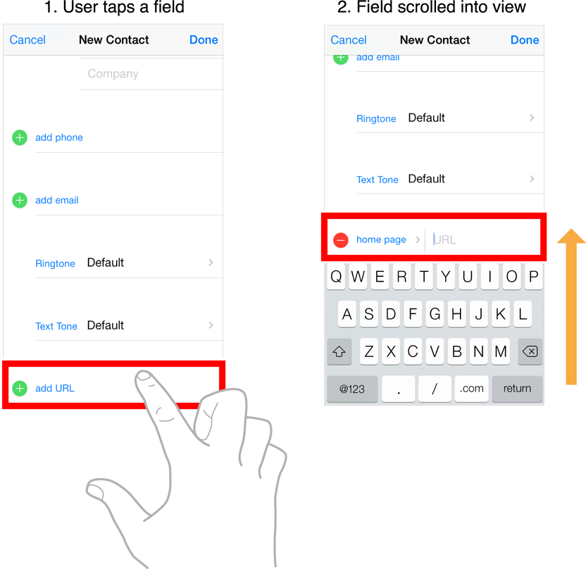

# Managing the Keyboard
사용자가 TextField, TextView 또는 웹뷰에 있는 입력필드를 터치했을 때 시스템에서 키보드가 보여지게 된다. 키보드의 여러 속성에 따라 어떤 키보드를 보여줄지 설정할 수 있다. 또한 에디팅이 시작되거나 끝날 때에 키보드를 어떻게 처리할 지도 결정할 수 있다. 포커스 되어 있는 부분을 키보드가 가리게 될 수도 있기 때문이다. 따라서 포커스되는 부분을 키보드 영역위로 올라오게 하여 포커스된 UI가 잘 보이게 하는 방법도 이에 포함된다. 

## Managing the Keyboard 
많은 UIKit 객체들은 자동으로 키보드를 작동시키지만, 여러 경우에 따라 여전히 키보드를 관리해야할 필요가 있다. 

### Receiving Keyboard Notifications
키보드가 나타나거나 사라질 때, iOS는 아래의 노티피케이션을 모든 등록된 옵저버에게 보낸다. 

* UIKeyboardWillShowNotification
* UIKeyboardDidShowNotification
* UIkeyboardWillHideNotification
* UIKeyboardDidHideNotification

각각의 키보드 노티피케이션은 키보드의 크기와 위치에 대한 정보를 포함하고 있다. `UIKeyboardFrameBeginUserInfoKey`와 `UIKeyboardFrameBeginUserInfoKey`를 사용하는 노티피케이션의 userInfo 딕셔너리 객체에서 키보드에 대한 정보를 가져와 사용할 수 있다. `UIKeyboardFrameBeginUserInfoKey` 는 beginning 키보드 프레임에 대한 값을 제공하고, `UIKeyboardFrameBeginUserInfoKey`는 ending 키보드에 대한 프레임을 제공한다. 키보드의 값들을 예상해서 사용하지 말고 항상 노티피케이션에서 가져와 사용하도록 해야한다. 입력 방법에 따라 키보드의 크기가 달라지기도 하고, iOS버전에 따라서도 달라지기 때문이다. 뿐만 아니라, 같은 버전의 iOS에서 같은 언어를 입력 한다고 해도 디바이스의 회전 상태에 따라서도 크기가 달라지게 된다. 노티피케이션에서 제공하는 키보드의 값들을 사용하면 항상 정확한 크기를 사용할 수 있게 될 것이다. 
또한 이 노티피케이션을 사용하는 이유는 키보드가 나타나거나 사라질 때 화면의 컨텐츠의 위치를 재조정하기 위함이다.

### Displaying the Keyboard
사용자가 View를 터치하게 되면 시스템은 자동으로 그 뷰를 `First Responder`로 지정하게 된다. 이런 상황이 Text Edit가 가능한 View에서 일어나게 된다면 View는 Editing Session을 시작한다. Editing Session이 시작될 때 View는 키보드가 떠있지 않는 상태라면 시스템에 키보드를 보여줄 것인지 물어보게 된다. 만약 키보드가 이미 떠있다면 키보드 인풋이 새롭게 `first responder`가 된 뷰로 이동하게 된다.

View가 `first responder`가 될 때 자동으로 키보드가 나타나기 때문에 키보드를 띄우는데 딱히 뭘 할필요가 없는 경우가 많다. 하지만 사용자가 input을 해야하는 View를 터치하지 않고도 키보드를 보여줄 수가 있다. 해당 뷰의 `becomeFirstResponder`메소드를 호출하게 되면 자동으로 키보드가 보여지게 되고 target View가 `first responder`가 되게 된다. 그리고 input또한 가능해진다. 

하나의 화면에 여러 개의 input을 위한 View를 갖고 있다면 현재 어떤 View가 `first responder`인지를 추적하여 적절한 시점에 키보드를 사라지게 해주는 것 또한 좋은 방법이다. 

### Dismissing the Keyboard
보통 시스템은 키보드를 자동으로 보여주지만 자동으로 감추지는 않는다. 따라서 앱에서 적절한 타이밍에 키보드를 감춰줘야 한다. 보통은 사용자의 이벤트에 따라 이루어진다. 예를들어, 사용자가 Return이나 Done버튼을 누르거나 앱의 UI중 다른 부분을 터치했을 경우에 키보드가 사라지기를 기대하게 된다.

키보드를 사라지게 하려면 현재 firstResponder인 뷰의 `resignFirstResponder`메소드를 호출하면 된다. 텍스트 뷰가 firstResponder인 상태를 resign하게 되면 이 뷰는 Editing session을 마치게 되고 뷰의 delegate에 이 사실을 알린 뒤 키보드를 사라지게 한다. 

### Moving Content That Is Located Under the Keyboard
시스템이 키보드를 띄우게 되면, 화면의 바닥에서부터 키보드가 올라오게 된다. 키보드가 다 올라오면 앱의 컨텐트를 가리게 되는 경우가 생긴다. 이 때, 텍스트 입력 객체 위로 키보드가 올라오게 되면 사용자가 입력하고자 하는 View가 보이지 않게 된다. 이런 경우에는 View의 위치를 조절하여 View가 계속 보일 수 있게 해주어야 한다.

Content를 조정하는 것은 주로 임시로 몇 개의 Viwe를 리사이징하여 재배치한 뒤 계속 보이게 하는 작업을 포함한다. 가장 간단한 방법은 Text객체와 키보드를 `UIScrollView`(또는 `UITableView`)에 같이 넣는 것이다. 키보드가 나타날 떄, ScrollView의 Content의 영역을 리셋해주는 작업만 해주면 된다. 따라서, `UIKeyboardDidShowNotification`에 대응할 Handler Method는 아래와 같은 조건을 만족시키면 된다.

1. 키보드의 크기를 알아낸다.
2. ScrollView의 아랫부분 사이즈를 키보드의 크기만큼 조정한다.
3. Target이 되는 Text View의 위치를 그 위에 위치하게 된다. 

아래 그림은 몇개의 TextField를 하나의 UIScrillView에 넣은 뒤 input작업을 하는 과정을 보여주고 있다. 키보드가 나타날 때, 노티피케이션 핸들러 메소드가 컨텐트와 스크롤 위치를 조정한 뒤, `scrollRectToVisible(_ rect: animate:)`메소드를 사용하여 textView를 적절한 위치에 이동 시키고 있다.



아래 objective-C 코드는 키보드 노티피케이션을 등록하고 그 노티피케이션들에 대한 핸들러 메소드를 보여주고 있다. scrollView를 제어하는 ViewController에서 이 코드를 작성해야 한다. `keyboardWasShown` 메소드는 노티피케이션의 info 딕셔너리에서 키보드의 사이즈를 가져온 뒤 스크롤뷰에서 target view의 위치를 조정해준다. 이 메소드에서 scrollIndicatorInsets프로퍼티도 설정하여 scrolling indicator가 키보드에 의해 가려지지 않게 해준다. 

현재 활성화된 텍스트필드가 키보드에 의해 가려져있다면 `keyboardWasShown` 메소드가 컨텐트의 위치를 적절하게 조절해줄 것이다.

``` objectiveC
// Call this method somewhere in your view controller setup code.
- (void)registerForKeyboardNotifications
{
    [[NSNotificationCenter defaultCenter] addObserver:self
            selector:@selector(keyboardWasShown:)
            name:UIKeyboardDidShowNotification object:nil];
  
   [[NSNotificationCenter defaultCenter] addObserver:self
             selector:@selector(keyboardWillBeHidden:)
             name:UIKeyboardWillHideNotification object:nil];
  
}
  
// Called when the UIKeyboardDidShowNotification is sent.
- (void)keyboardWasShown:(NSNotification*)aNotification
{
    NSDictionary* info = [aNotification userInfo];
    CGSize kbSize = [[info objectForKey:UIKeyboardFrameBeginUserInfoKey] CGRectValue].size;
  
    UIEdgeInsets contentInsets = UIEdgeInsetsMake(0.0, 0.0, kbSize.height, 0.0);
    scrollView.contentInset = contentInsets;
    scrollView.scrollIndicatorInsets = contentInsets;
  
    // If active text field is hidden by keyboard, scroll it so it's visible
    // Your app might not need or want this behavior.
    CGRect aRect = self.view.frame;
    aRect.size.height -= kbSize.height;
    if (!CGRectContainsPoint(aRect, activeField.frame.origin) ) {
        [self.scrollView scrollRectToVisible:activeField.frame animated:YES];
    }
}
  
// Called when the UIKeyboardWillHideNotification is sent
- (void)keyboardWillBeHidden:(NSNotification*)aNotification
{
    UIEdgeInsets contentInsets = UIEdgeInsetsZero;
    scrollView.contentInset = contentInsets;
    scrollView.scrollIndicatorInsets = contentInsets;
}
```
-------------------------------------------------------------------------------------
[출처](https://developer.apple.com/library/content/documentation/StringsTextFonts/Conceptual/TextAndWebiPhoneOS/KeyboardManagement/KeyboardManagement.html#//apple_ref/doc/uid/TP40009542-CH5-SW1)


