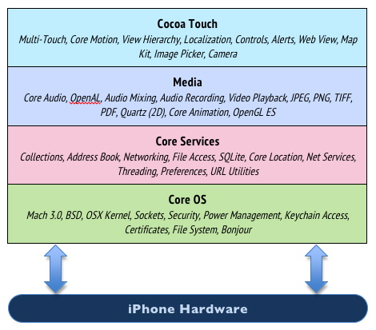

# Cocoa Framework
Cocoa란 애플 환경에서 애플리케이션을 제작하기 위한 도구들의 모음이다. Cocoa가 제공하는 도구 중 가장 대표적인 것이 유저 인터페이스(UI)이다. Mac OS X와 iOS의 많은 애플리케이션들이 비슷비슷한 UI를 가지고 있는 이유는 바로 이 Cocoa에서 제공하는 UI 기능들을 사용하기 때문이다. 

Coocoa는 UI뿐만 아니라, 맥이나 iPhone/iPad의 하드웨어를 다루는 데 필요한 많은 기능들을 제공한다. 또한, 프로그램과 자료구조를 다루는 데 사용하는 많은 표준들도 제공한다.

이 Cocoa는 여러 개의 Framework로 이루어져 있다. Framework는 흔히 얘기하는 Shared Library 또는 API와 비슷한 개념으로, 어떤 기능에 관련된 함수들을 모아놓은 것이다. 

## Framework의 계층 구조 
따라서 Cocoa는 여러 Framework들의 집합이라고 볼 수 있다. 그중에서도 Cocoa에 속하는 Framework는 보통 가장 상위 레벨의 Framework들 이다. 바꿔 말하면, 프로그래머가 필요한 기능을 가장 손쉽게 사용할 수 있다는 뜻이다. 이러한 상위레벨의 Cocoa Framework는, 내부적으로 하위 레벨의 Framework를 이용하여 이와 같은 기능을 구현한다. 

예를 들면, Cocoa의 AppKit Framework에서 제공하는 NSWindow라는 클래스는 애플리케이션의 윈도우를 그려준다. 윈도우 이동, 크기 조절 등의 기능을 모두 포함한다. 프로그래머는 일일히 이런 기능을 구현하지 않아도, NSWindow 클래스를 이용해 유저에게 같은 기능을 제공할 수 있다. 따라서 AppKit Framework는 매우 상위 레벨의 Framework라고 할 수 있다.

하지만 이러한 윈도우의 기능을 구현하려면, 내부적으로는 보다 하위 레벨의 작업을 처리해야 한다. 예를 들면 화면에 윈도우를 그리고, 또 크기 조절 아이콘 같은 것들을 배치하는 일들이 필요하다. 이렇게 화면에 그래픽을 표시하기 위해, AppKit Framework는 Core Graphics라는 하위 레벨 Framework를 사용한다. 

이처럼 프로그래머는 상위 레벨의 Framework를 사용하고, 상위 레벨 Framework은 하위 레벨 Framework를 사용한다. 이로써 프로그래머는 상위 레벨의 Framework만 알면, 여러가지 복잡한 기능들을 손쉽게 구현할 수 있게 된다. 하지만 경우에 따라 상위 레벨 Framework가 제공하지 않는 기능을 필요로 할 때는 (예를 들어 별 모양으로 생긴 윈도우를 만들고 싶다면), 프로그래머가 직접 하위 레벨 Framework를 이용하여 원하는 기능을 직접 구현하기도 한다. 

이러한 Framework의 계층 구조를 이해하고 있으면, 원하는 기능을 제공하는 Framework를 빨리 찾을 수 있다. 먼저 상위 계층의 Framework에서 필요한 기능을 제공하는 것을 찾고, 만약 원하는 기능이 제공되지 않는다면, 그보다 하위 계층의 Framework들을 검토해 보면 된다. 

iOS는 다음과 같이 4개의 층으로 구성된다. 위에 있을수록 유저와 가깝고, 아래 있을수록 하드웨어와 가깝다.

* Cocoa Touch
* Media
* Core Services
* Core OS

### Cocoa Touch
화면이나 버튼 등 유저 인터페이스(UI)와 관련된 Layer이다. View hierarchy, Map Kit, Web View, Camera, Alerts, CoreMotion, Localization, Multi touch, Image Picker등 UI와 연관된 것들이 모두 여기에 포함된다.

### Media
음악, 영상, 애니메이션, 사진 등의 그래픽과 관련된 층이다. Core Audio, Audio Mixing, Audio Recording, Video Playback, PNG, JPEG, OpenAL, PDF, Quartz(2D), Core Animation, OpenGL등이 관련된다.

### Core Services
Foundation이 포함되는 층으로서 네트웡킹, 데이터베이스, 파일 관리와 관련되는 층이다. import Foundation을 하여 가져오는 메서드들이 여기와 관련된다. UI와는 무관하다. Collection, Core Location, Address Book, Net Services, Networking, Threading, File Access, Preferences, SQLite, URL, Utilities등이 포함된다.

### Core OS
C언어로 짜여진 유닉스 OS층이다. 일반 앱 개발자로서 거의 직접 접근하지 않는 층이다. iOS의 거의 모든 기능의 기본적인 부분을 관리한다. OSX Kernel, Power Management, Mach 3.0, Keychain Access, BSD, Certificates, Sockes, File System, Security, Bonjour 등이 이 영역에 포함된다. 

하위레이어는 iOS의 핵심 부분 또는 하드웨어에 가까운 기능을 가지고 있고, 상위레이어 그 다음 레이어의 기능을 추상화한 인터페이스를 가지고 있다. 

## UIKit and Foundation
위에서 말했듯이 프레임워크는 앱 개발에서 필요한 기능들을 파트별로 정리한 것이다. 애플은 프레임워크를 패키지로 관리한다. 그리고 개발자는 이런 기능을 불러와 원하는 앱을 쉽게 구현할 수 있다. 

iOS앱 개발에서 가장 많이 이용되는 것은 화면 구성을 하는 `UIKit`과 내부 데이터관리인 Foundation 두가지가 대표적이다. 이 두가지를 통해 다른 프레임워크로 보강해서 개발을 진행하는 것이 일반적이다. 

`Foundation`은 프로그램의 중심을 담당한다. 애플리케이션의 모든 오브젝트들을 관리하는 기본적은 틀을 제공하기도 하고, 메모리를 할당하거나 반환하는 기본적인 규칙을 정의하기도 하며, 리스트나 딕셔너리와 같은 컨테이너들을 제공하기도 한다. 위 그림에서 Foundation은 Core Services 레이어에 해당하는 Framework 이다.

iOS앱 개발에서 자주 이용되는 프레임워크는 다음과 같다.

레이어|이름|설명
---------------|-----------|-----------
Cocoa Touch| UIKit | 화면 구성과 터치
 | MapKit | 지도 관련 기능
 | MessageUI | 이메일/메세지 전송
Media| AvFoundation | 미디어 재생관련
 | MediaPlayer | 플레이어 이용 
 | Core Image | 이미지 가공
 | Core Graphics | 그래픽 관련
Core Services| Accounts | 소셜미디어 계정관리
 | CoreMotion | 기기 센서
 | CoreLocation | 위치 정보 관련 기능
 | Foundation | 데이터 관리
 | LocalAuthentication | 지문 확인 

iOS에서 프레임워크는 기능별로 나누어져 있고 프레임워크명 및 하위 프레임워크의 클래스명도 구현할 수 있는 기능을 쉽게 확인할 수 있도록 되어 있다. 즉, 개발자가 쉽게 이해할 수 있도록 하기 위함도 있지만 문서로 이용시 원하는 기능을 빠르게 검색할 수 있도록 위함도 있다. iOS업데이트가 일어나면 새로운 기능 추가와 같이 프레임워크도 업데이트되기 때문에 항상 iOS앱 개발을 한다면 애플의 개발자 사이트를 확인하는 습관을 가지자. 

