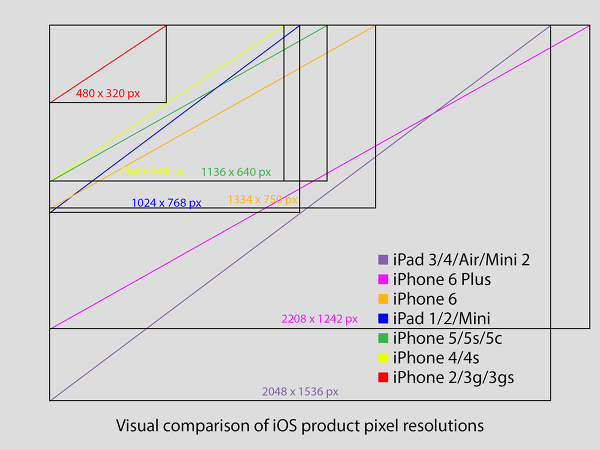

# iOS 멀티 해상도 디자인 가이드

## 좌표체계, 화면비율
iOS 내에서의 화면 좌표는 좌/상단을 0,0으로 하는 point 단위를 기본으로 사용한다. 디자이너는 이 단위를 기준으로 **디자인 가이드**를 개발자에게 제공해야 한다. 디자인 가이드의 아이콘/이미지 등의 크기/위치는 이 값을 기준으로 한다. 이 단위는 각 기기별로 다음과 같다. 

``` 
// 포인트 해상도 
iPhone 6+: 414×736 (16:9)
iPhone 6 : 375×667 (16:9)
iPhone 5 : 320×568 (16:9)
iPhone 4 : 320×480 (3:2)
iPad HD:  768×1024 (@2x)
iPad:       768×1024 (@1x)
```

## 이미지 크기


위 그림은 디자인으로 작업해야 하는 실제 기기별 해상도를 나타낸 것이다. 쉽게 말해서, 디자이너가 포토샵으로 작업해야 하는 해상도라 보면 된다. 물론, 개발자는 전달받은 이미지 리소스들의 실제 픽셀단위 크기를 알 필요까지는 없다. 이미지는 각각 1배, 2배, 3배 크기의 해상도를 갖도록 디자인되어야 하며, 이는 같은 내용의 이미지가 해상도 별 3개가 한 세트를 이룬다고 볼 수 있다. (@1x - iPhone3 이하, @2x - iPhone4~6, @3x - iPhone6+)


> **해상도가 서로 다른 iPhone4~6는 왜 같은 해상도의 2x를 사용하는가?**
> 이는 PPI(Pixel Per Inch) 가 같기 떄문이다. PPI 는 화면의 크기(1인치)에 보이는 픽셀의 개수를 의미한다. 

```
// 픽셀 해상도
iPhone 6+: 2208 x 1242 (16 x 9)
iPhone 6:  1334 x 750 (16 x 9)
iPhone 5:  1136 x 640 (16 x 9)
iPhone 4:  960 x 640 (3 x 2)
iPad HD:   2048 x 1536 (4 x 3)
iPad:      1024 x 768 (4 x 3)
```

## 이미지 명명 방법
이미지 크기를 100x50px 이라 가정했을 때, 이 이미지는 아래와 같이 명명할 수 있다. 
```
image_sample_01.png : 100×50 px (@1x 생략)
image_sample_01@2x.png : 200×100 px
image_sample_01@3x.png : 300×150 px
```
