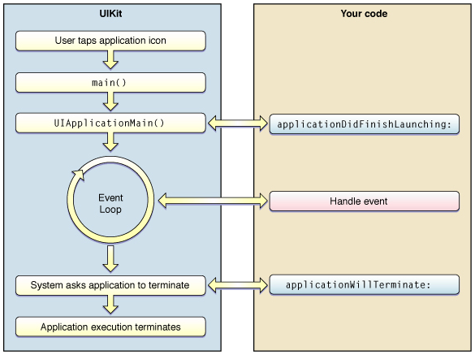

# 앱 생명주기(App Lifecycle) vs 뷰 컨트롤러 생명주기(ViewController Lifecycle)
## 앱 생명주기(App Lifecycle)

위의 그림은 iOS 어플리케이션의 생명주기를 설명하는 그림이다. 앱의 실행순서는 다음과 같이 이루어진다.
```
1. 사용자가 어플리케이션을 탭한다.
2. main() 함수가 호출된다.
3. UIApplication객체가 생성되고, UIApplicationMain()이 호출된다. 
4. AppDelegate객체가 생성되며, AppDelegate함수인 didFinishLaunchingWithOptions 이 호출된다.
5. 개발자가 설계하고 작성한 어플리케이션의 코드가 동작한다.
6. 어플리케이션 종료를 명령하면 AppDelegate의 applicationWillTerminate가 호출된다.
7. 어플리케이션이 종료된다.
```
`UIApplication`과 `AppDelegate`에 대해서 설명을 하자면, `UIApplication`객체는 싱글톤 객체(앱 전체에 하나만 존재)이며, Event Loop에서 발생하는 여러 이벤트들을 감지하고 Delegate에 전달하는 역할을 한다. `AppDelegate`객체는 `UIApplication`객체로 부터 메세지를 받았을 때, 해당 상황에서 실행 될 함수들을 정의한다. Xcode로 Swift 프로젝트를 만들면 자동으로 생성되는 `AppDelegate.swift` 파일이 있는데 이 파일이 `AppDelegate`객체가 된다. 왜냐하면 `AppDelegate.swift`을 열어보면 클래스 선언부에 `@UIApplicationMain`어노테이션이 붙어 있는걸 볼 수 있다. 즉, 앱이 구동되면 `AppDelegate.swift`의 AppDelegate클래스를 델리게이트 객체로 지정한다. `AppDelegate.swift`파일에는 앱의 상태에 따라 실행되는 함수들이 정의되어있다. 함수를 알아보기에 앞서 앱의 실행 상태는 5개의 상태로 구분될 수 있으며 아래와 같다.

```
Not Running: 앱이 실행되지 않은상태
(Inactive와 Active 상태를 합쳐서 Foreground 라고 함)
Inactive: 앱이 실행중인 상태 그러나 아무런 이벤트를 받지 않는 상태
Active: 앱이 실행중이며 이벤트가 발생한 상태
Background: 앱이 백그라운드에 있는 상태 그러나 실행되는 코드가 있는 상태
Suspened: 앱이 백그라운드에 있고 실행되는 코드가 없는 상태
```

`AppDelegate.swift`에는 아래와 같이 앱의 상태에 따라 실행되는 delegate 함수들이 정의되어 있기때문에 함수안에 코드를 작성 함으로써 앱의 특정 상태에서 동작하는 로직을 구현 할 수 있다.

```
application(_:didFinishLaunching:) - 앱이 처음 시작될 때 실행
applicationWillResignActive: - 앱이 active 에서 inactive로 이동될 때 실행 
applicationDidEnterBackground: - 앱이 background 상태일 때 실행 
applicationWillEnterForeground: - 앱이 background에서 foreground로 이동 될때 실행 (아직 foreground에서 실행중이진 않음)
applicationDidBecomeActive: - 앱이 active상태가 되어 실행 중일 때 실행
applicationWillTerminate: - 앱이 종료될 때 실행
```

위의 함수를 모두 구현 할 필요는 없고 상황에 맞춰 필요한 함수만 구현하여도 된다. 혹은 위 함수들에는 없지만 원하는 delegate를 추가할수도 있다.


## 뷰 컨트롤러 생명주기(ViewController Lifecycle)
모바일 앱은 화면의 크기가 작아 PC와 달리 하나의 화면에 하나의 ViewController만을 가진다. 그리고 여러개의 `ViewController`가 모여 하나의 앱을 만든다. iOS 에서는 한 화면에서 다른 화면으로 전환할 때 기존의 화면위에 새로운 화면이 쌓이는 식으로 화면을 전환 한다. 이 때 각각의 뷰 컨트롤러는 자신만의 생명주기를 가지고 있고 이 생명주기를 잘 이해하고 있다면 뷰 컨트롤러의 상황에 따라 원하는 로직을 수행하도록 만들 수 있다. 

여러개의 뷰 컨트롤러가 있는 앱이라고 한다면 각각의 뷰 컨트롤러는 자신만의 생명주기를 가진다. 그래서 화면상에 등장 할 때, 사라질 때 등 상황에 맞춰서 함수들이 호출된다. 뷰 컨트롤러 생명주기의 대표적인 함수들은 아래와 같다.

```
ViewDidLoad - 해당 뷰컨트롤러 클래스가 생성될 때(ViewWillAppear전에 실행) 실행된다. Low memory와같은 특별한 경우가 아니라면 딱 한번만 실행되기 때문에 초기화 할 때 사용 할 수 있다.
ViewWillAppear - 뷰 컨트롤러가 화면에 나타나기 직전에 실행된다. 뷰 컨트롤러가 나타나기 직전에 항상 실행되기 때문에 해당 뷰 컨트롤러가 나타나기 직전마다 일어나는 작업들을 여기에 배치 시킬 수 있다.
ViewDidAppear - 뷰 컨트롤러가 화면에 나타난 직후에 실행된다. 화면에 적용될 애니메이션을 그리거나 API로 부터 정보를 받아와 화면을 업데이트 할 때 이곳에 로직을 위치시키면 좋다. 왜냐하면 지나치게 빨리 애니메이션을 그리거나 API에서 정보를 받아와 뷰 컨트롤러를 업데이트 할 경우 화면에 반영되지 않는다.
ViewWill/DidDisappear - 뷰 컨트롤러가 화면에 나타난 직전/직후에 실행된다.
```