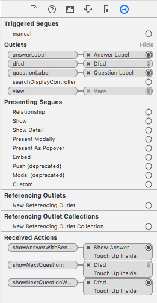

# 객체 연결하기 (Object Connection)
커넥션(connection)은 한 객체에게 메모리상의 또 다른 객체가 어디 있는지 알려주는 역할을 한다. 따라서 두 객체가 서로 통신하게 된다. `인터페이스 빌더`에서 만들 수 있는 커넥션은 두 종류가 있다. `아웃렛(outlet)`과 `액션(action)`이다. 아웃렛은 객체에 대한 참조다. 액션은 버튼이나 슬라이더, 피커 등과 같은 사용자에 반응하는 뷰에 의해 수행되는 메소드이다.

## 아웃렛 선언하기
`View Controller`에 프로퍼티를 선언하는 코드를 추가한다.
```swift
import UIKit

class ViewController: UIViewController{
	@IBOutlet var questionLabel: UILabel!
	@IBOutlet var answerLabel: UILabel!
}
```
`View Controller`는 특정 `UILabel`객체를 참조하기 위해 각 아웃렛을 사용할 수 있다. 여기서 `IBOutlet` 키워드는 `Xcode`에게 해당 아웃렛이 `인터페이스 빌더`를 사용하여 라벨 객체와 연결한다는 것을 알린다.

## 아웃렛 설정하기
`인터페이스 빌더` 의 도큐먼트 아웃라인에 있는 `View Controller`에서 설정하고 싶은 객체로 컨트롤-드래그(또는 우클릭과 드래그)한다. 검은 패널이 나타나면, `View Controller`에 선언한 프로퍼티를 선택한다.

## 액션 메소드 정의하기
사용자가 발생시킨 이벤트는 또 다른 객체의 메소드를 호출한다. 그 객체를 `타깃(target)`이라 하고, 호출되는 메소드를 `액션(action)`이라고 한다. 이 액션은 이벤트가 발생 했을 때, 반응하는 실행 코드를 가진 메소드의 이름이다.

```swift
import UIKit

class ViewController: UIViewController{
	@IBOutlet var questionLabel: UILabel!
	@IBOutlet var answerLabel: UILabel!

	@IBAction func showNextQuestion(sender: AnyObject){
	}

	@IBAction func showAnswer(sender: AnyObject){
	}
}
```
`@IBAction` 키워드는 `Xcode`에게 인터페이스 빌더로 커넥션을 만들겠다고 알려준다.

## 타깃과 액션 설정하기
`인터페이스 빌더`로 돌아가 설정하고 싶은 객체의 타깃을 `View Controller`로 하고 액션은 `View Controller`에 선언한 메소드로 설정한다.
객체의 타깃을 설정하려면 객체에서 컨트롤-드래그(또는 우클릭과 드래그)하여 그 타깃에 놓는다. 마우스를 놓을 때 타깃이 설정되고 액션을 선택할 수 있는 검정색 팝업 메뉴가 나타난다.

### 커넥션 인스펙터(connections inspector)
위에서 설정한 모든 커넥션들은 `커넥션 인스펙터(connections inspector)`에서 확인할 수 있다.


-------

뷰 객체를 만들고 설정하였으며, 컨트롤러 객체에 필요한 객체 연결이 완료되었으니 이후에 모델 객체를 만들고 연결해 보도록 할 것이다. 
[모델 레이어 만들기](https://github.com/singhee/TIL/blob/master/ios/model_layer.md)


