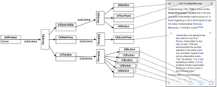

# 뷰의 계층 구조

iOS 앱은 모든 뷰들의 컨테이너 역할을 하는 `UIWindow`인스턴스를 하나 가진다. `UIWindow`는 `UIView`의 하위 클래스이므로 윈도우는 그 자체가 **뷰**이다.
앱이 실행되면 윈도우가 만들어진다. 윈도우가 만들어지면 윈도우에 다른 뷰들을 추가할 수 있다. 윈도우에 추가한 뷰를 `하위 뷰(subview)`라고 한다. 윈도우의 하위 뷰 또한 하위 뷰를 가질 수 있는데, 이는 윈도우를 루트로 한 뷰 객체들의 계층 구조로 이루어져 있다.

뷰들이 화면에 그려지는 과정은 두 단계로 나누어 진다.
1. 윈도우를 포함한 계층 구조의 각 뷰들은 자기 자신을 그린다. 뷰는 그 자체를 자신의 레이어에 나타낸다.
2. 모든 뷰의 레이어들이 화면에 합성된다.

# 뷰와 프레임
`CGRect`타입은 뷰의 프레임을 나타내는 `UIView`의 fram 프로퍼티를 나타낸다.
	
	var frame : CGRect
frame 은 뷰의 크기와 상위 뷰를 기준으로 한 뷰의 위치를 지정한다. 뷰의 크기는 항상 frame 에 의해 명시되기 때문에 항상 사각형이다. `CGRect`타입은 `origin`과 `size`를 멤버로 가진다. 

> **origin** : CGPoint 타입의 구조체로, 두 개의 CGFloat 프로퍼티(CGFloat x, CGFloat y) 를 가진다.
> **size**: CGSize 타입의 구조체로, 두 개의 CGFloat 프로퍼티(CGFloat width, CGFloat height) 를 가진다.

앱이 실행되면 `ViewController`클래스에 의해 표현되는 최초의 뷰 컨트롤러의 뷰는 루트 레벨 윈도우에 추가된다. 

frame 의 멤버들(origin, size)의 값들은 `픽셀`단위가 아닌 `포인트` 단위이다. 만약 이 값들이 `픽셀` 단위라면 다른 해상도를 가진 디스플레이들 간에 일관성을 가질 수 없다. 반면에 `포인트`는 상대적인 측정 단위다. 디스플레이의 `픽셀` 수에 따라 `포인트`의 `픽셀` 수가 달라질 것이다. 크기, 위치, 선, 곡선은 디스플레이 해상도에 따라 차이를 두기 위해 항상 `포인트`로 기술한다.

모든 `UIView`인스턴스는 `superview` 프로퍼티를 가진다. 또한 모든 뷰의 frame 은 자신의 상위 뷰(superview)에 상대적으로 적용된다.