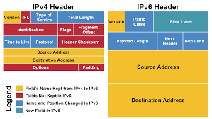

# IPv6
IPv6는 "Internet Protocol Version 6"의 줄임말이며 차세대 인터넷 환경을 위해 만들어진 인터넷 프로토콜이다. 현재까지도 널리 사용되고 있는 IPv4를 서서히 대체해 나가게 될 것이다. 아직 IPv6가 많이 쓰이고 있지는 않지만, 이미 많은 통신관련 제품들이 IPv6 지원을 고려해서 제작되어지고 있다.

## 1. IPv6 탄생 배경
시대가 흐름에 따라서 인터넷과 컴퓨팅 환경은 엄청난 변화를 맞이하게 되었고 지금에 와서는 IPv4를 이용해 앞으로의 인터넷 환경을 확장/유지 할 수 있을것인가 하는 의문을 가지기 시작했다. 

## 1-1. 인터넷의 폭발적인 증가 == IP 주소 부족
IPv4는 1981년 부터 지금까지 쓰이는 아주 오래된 프로토콜이다. 1981년 당시에는 인터넷 주소를 위한 크기 할당을 2^32 정도로 한다면, 이 프로토콜은 아주아주 오랫동안 쓰일 수 있을것이라고 생각하였다. 2^32는 42억이 넘는 크기로, 42억대의 호스트에 유일한 주소를 할당할 수 있는 정도의 크기였다. 당시의 인구 상황이나, 호스트 수, 컴퓨팅/네트워크 환경 등을 생각한다면 충분한 숫자였다.

인터넷이 풀발한 1969년 부터 대략 20년이 지난 1990년 까지도 인터넷은 그리 성공적이지 못하였다. 그러던것이 1992년 100만대 호스트를 넘기면서 부터 매년 100% 이상 성장하기 시작하였다. 이러한 인터넷의 증가추세는 앞으로도 계속 이어질 것이다. 또한 이동통신 기기나 가전제품, 사물인터넷 등의 증가로 IP부족현상은 더욱 심각해 질 것이다. 

## 1-2. IPv4의 부족의 해결책 NAT?
IPv4에도 IP부족을 해결하기 위한 나름대로의 해결책을 가지고 있기는 하다. 
동적 IP 할당과, 사용하지 않는 주소의 재할당 NAT(Network Address Translator)이 바로 그것이다. 

그러나 이 방법들은 한계를 지닌다. 동적 아이피 할당의 경우 IP번호가 바뀜으로 인터넷 연결 통로가 고정되지 못한다는 단점이 있다. 사용하지 않는 IP번호의 재사용 역시 사용하지 않는 IP의 수보다 더 많은 IP수요가 발생함으로 근본적인 한계를 지닌다. 

NAT의 경우 사설IP 라는 특징 때문에 양방향 인터넷 통신에 많은 제약이 생긴다. 많은 인터넷 서비스, 온라인 게임등은 사설망에서 아예 사용 불가능 할 수도 있다. 

# 2. IPv6는 IPv4의 문제점을 해결할 수 있는가
## 2-1. 주소 부족문제
IPv4는 주소를 지정하기 위해서 32bit를 할당한다. 반면 IPv6는 주소 지정을 위해 128bit의 크기를 할당한다. 이는 2^128개 만큼의 주소 할당이 가능하다는 것을 알 수 있다. 

## 2-2. 성능 향상
IPv6는 IPv4에 비해 단순한 패킷구조를 가지고 있다. 
IPv4와 IPv6의 패킷 헤더 구조는 다음과 같다. 

보면 알겠지만 헤더가 훨씬 단순해졌음을 볼 수 있다. 헤더가 단순해졌다는 것은 그만큼 router에서의 **빠른 처리**가 가능하다는 것을 의미한다. 제거된 필드들을 보면 주로 패킷체크와 관련된 것들이다. 이러한 체크들은 Ethernet계층(Link Layer)에서도 이미 이루어지는 것들임으로 불필요한 오버헤드다. 또한 네트워크 환경도 좋아지고 컴퓨팅 환경도 좋아져서 굳이 이러한 체크들이 필요 없어졌기 때문이기도 하다. 

## 2-3. 보안
Ipv6는 Encapsulating Security Payload(ESP) 라는 헤더를 이용해서 패킷 보안을 가능하게 했다. 이 헤더는 IPv6의 오리지날 헤더 다음에 붙는 일종의 확장 헤더이다. 이 헤더의 정보를 이용해서 패킷의 보안이 이루어지게 된다.

보안은 크게 인증과 데이터의 암호화로 이로우진다. 인증은 서버와 클라이언트간에 교환되는 데이타를 중간에서 수정하거나 파괴할수 없게 하기 위해 사용되며, 암호화는 말그대로 데이타의 내용을 인증되지 않은 사용자가 볼수없도록 하기 위해서 사용된다.

암호화 방법은 고정되어 있는게 아니며 상황에 따라서 선택할 수 있다. 또한 암호화가 필요하지 않다고 생각되면 생략할 수도 있다. 

## 2-4. 주소 자동 설정
IPv6 는 stateless 라는 주소자동 설정 방법을 제공함으로써, 사용자가 일일이 네트웍 환경을 파악해서 자신의 호스트에 IP 주소를 할당해야 하는 불편함을 없애주었다.

물론 이러한 기능은 IPv4 에서도 DHCP(Dynamic Host Configuration Protocol)를 이용해서 관리하고 있는 네트웍의 호스트에 자동으로 IP 번호를 부여하도록 해주고 있다.

그러나 DHCP 역시 DHCP 서버가 있어야 한다는 단점을 가진다. DHCP 서버가 있으니 당연히 서버관리역시 필요하다. DHCP 서버가 필요하다는 뜻은 모든 사이트 영역을 감당할수 없다는 것을 의미한다. ( 그리고 DHCP 는 인터넷 주소 부족에 의한 IP 자원의 재활용측면에서 등장한 측면이 있다.)

## 2-5. Qos
IPv6 는 Flow Label 이라는 장치를 통해서 Qos(Quality of Servide) 를 지원한다.

QoS 란 서비스가 사용하는 인터넷 리소스의 자원과 특성에 따라서 거기에 맞도록 데이타를 전송하는 서비스를 말한다. 예를들어 VOD 데이타와 HTTP 데이타를 라우터가 받았다면, VOD 데이타를 우선적으로 처리하는 어떤 알고리즘을 적용한다면 양질의 VOD 와 HTTP 서비스를 동시에 만족 시킬수 있을것이다. 기존의 경우 데이타를 동일하게 처리함으로 결과적으로는 VOD 데이타를 위해서는 자원이 부족하고 HTTP 데이타를 위해서는 오히려 자원을 낭비하는 결과를 초래했다. 이것은 자원낭비다.

IPv6 는 프로토콜 차원에서 QoS 를 제공한다. 이는 라우터 단위에서 데이타의 특성에 따른 서비스의 질을 결정시킬수 있음으로 좀더 균형된 인터넷환경을 만들어 준다.

