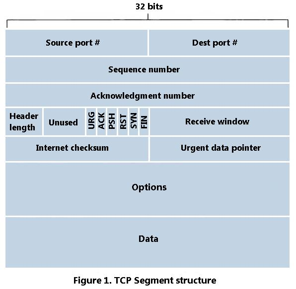

#[Computer Network] Transport Layer

## 신뢰성 있는 데이터 전송의 원리 (Principles of Reliable Data Transfer)

### 파이프라인 프로토콜 (Pipelined Protocol)
1. Sender가 ACK응답을 기다리지 않고 여러 패킷을 전송한다.
2. SeqNum 의 범위는 증가하여 전송 중인 패킷은 유일한 SeqNum 을 가진다. 
3. Sender 측과 Receiver측이 패킷을 버퍼링 해야 한다. 

### Pipelining Protocol 개요
1. GBN (Go-Back-N) 
- Sender는 파이프라인에서 최대 N개의 ACK 없이 패킷 전송 허용한다.
- Receiver는 누적된 ACK(cumulative ACK)만을 전송, 수신된 패킷들의 SeqNum에 갭이 있으면 ACK 응답하지 않는다.
- Sender는 가장 오래된 '전송 되었지만 ACK 응답 없는 패킷'에 대한 타이머를 가진다. 타이머가 만료되면 ACK 응답 없는 모든 패킷들을 재전송한다.

2. Selective Repeat
 - Sender는 파이프라인에서 최대 N개의 ACK 없이 패킷 전송 허용한다.
 - Receiver는 개별 패킷들에 대해 ACK 응답한다.
 - Sender는 '전송 되었지만 ACK 응답 없는 패킷'들 각각에 대해 개별 타이머를 관리하며, 타이머 만료 시 ACK 응답 없는 패킷만 재전송한다.

## TCP(Tansmission Control Protocol)
### 1. Full Duplex Data 
- 같은 연결 상에서 양방향 데이터 흐름
- 최대 세그먼트 크기(MSS : Maximum Segment Size

### 2. Connection-Oriented
데이터 교환 전에 Sender, Receiver 의 상태를 초기화하는 핸드셰이킹(handshaking, 제어 메시지들의 교환)

### 3. Flow Contol 
Sender는 Receiver의 수신한계를 넘어서는 Send를 하지 않는다.

### 4. TCP Segment Structure

- Sequence Number : 세그먼트에서 첫 번째 바이트의 바이트 스트림 번호. 시작 SeqNum은 임의로 선택
- ACK : 상대방으로부터 기대하는 다음 바이트의 SeqNum. 누적 ACK(cumulative ACK)

