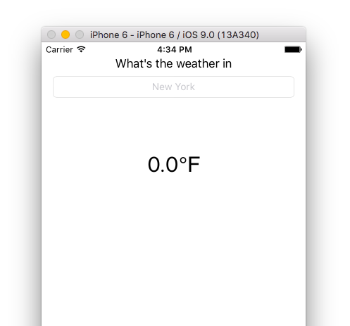

# MVVM in iOS with RxSwift
여기서는 RxSwift 와 MVVM에 대한 자료를 검색하면서 찾게된 문서를 번역한 내용을 정리해 보도록 할 것이다. 
[-Implementing MVVM in iOS with RxSwift -](https://medium.cobeisfresh.com/implementing-mvvm-in-ios-with-rxswift-updated-for-swift-2-51cc3ef7edb3)

> ReactiveX is a library for composing asynchronous and event-based programs by using observable sequences. 
> - [reactivex.io](http://reactivex.io/)

RxSwift는 ReactiveX가 Swift로 변형한 형태로 프로그램을 reactive하게 할 수 있는 아주 멋진 프레임 워크이다. 당신이 이것이 의미하는 것을 이해하지 못했다면, functional reactive programming이 떠오르고 관심이 많아지고 있기 때문에 이해하여야 한다. reactive한 program을 만들 수 있다는 것은 유지보수하기 쉬우며 다루기 쉬운 프로젝트를 만들 수 있다는 것을 의미한다. 

## iOS 의 컴포넌트는 어떻게 커뮤니케이션 할까?
RxSwift의 가장 큰 장점은 앱의 여러 구성 요소간의 커뮤니케이션을 단순화한다는 것이다. 예를 들면, Model과 ViewController를 들 수 있다. MVC 프레임워크에서 이 둘을 연결하는 것은 매우 지저분한 코드를 작성하게 한다. 

당신은 Model이 변경되어야 한다고 생각할 때 `updateUI()`를 호출하여 ViewControlle안의 모든 아울렛을 재설정할 것이다. 이로 인해 Model과 ViewController 사이에 불필요한 업데이트나 버그로인한 불일치가 발생할 수 있다. 우리들이 필요한 것은 Model의 실제 상태를 보여주는 ViewController이다. 

물론 대부분의 app이 Model을 보여주기만 한다면 쓸모가 없을 것이다. 우리는 Model로 부터 데이터를 뽑아내고 그것을 보여주기 위한 준비가 되어있을 필요가 있다. 바로 ViewModel 클래스가 우리가 표시해야하는 모든 데이터를 위한 준비를 해주는 것이다.

그러나 재미있는 점은 ViewModel은 ViewController에 대해 아무것도 모른다는 것이다. 내부의 속성에 대해 직접적으로 참조하거나 설정하지 않고, 대신에 ViewController 는 ViewModel에서의 변경 사항을 지속적으로 관찰하며 변경된 사항이 있다면 바로 표시한다.

이것은 각 property마다 기본적으로 적용이 되는 것이다. 즉, ViewController가 ViewModel 내부의 각 property를 표시한다. 예를 들어, 문자열과 이미지를 로드하려 할 때, 둘 다 로드될 때까지 기다릴 필요없이 한 번에 모두 표시 할 수 있게된다.

그리고 ViewController는 데이터를 표시 할 뿐만 아니라 유저의 입력 또한 받는다. ViewController는 단지 프록시 일 뿐이므로, 입력이 들어오면 ViewModel에 전달하게 되고 ViewModel이 나머지를 처리하게 되는 것이다.


위의 그림은 ViewController과 ViewModel 간의 단방향 커뮤니케이션을 나타낸 것이다. ViewController는 ViewModel을 바라보며, 신호를 줄 수 있지만, ViewModel은 ViewController의 존재에 대해서 알지 못한다. 즉, 이것은 당신의 앱에서 ViewController를 완전히 제거하고도 당신이 생각했던 로직이 의도한대로 작동할 수 있다는 것이다!

그렇다면, 어떻게 해야할까?

## MVVM with RxSwift
유저가 입력한 도시의 날씨예보를 표시해주는 간단한 앱을 만들어 보도록 하겠다.

위와 같이 도시의 이름을 입력할 수 있는 UITextField(SearchText)와 현재의 온도를 표시하는 UILabel 있다. Model은 도시 이름과 온도를 가진 Weather 구조체가 될 것이고, JSON객체로 초기화 되어 프로퍼티를 파싱하고 설정할 것이다.
```swift
struct Weather {
   let cityName: String
   let degrees: Double
 
   init?(json: JSON) {
      //parsing...
   }
}
```

이제 SearchText의 속성이 변경될 때 ViewModel이 새 모델을 요청하도록 해야한다. ViewController는 나중에 유저 입력을 ViewModel에 보내기 위해 이 프로퍼티에 접근 할 수 있다. 

```swift 
final class ViewModel {
 
   private struct Constants {
     static let URLPrefix = "http://api.openweathermap.org"
     static let APPID = /* my openweathermap APPID */
   }
 
   private let disposeBag = DisposeBag()
 
   let searchText = Variable<String>("")
```

이제 계획에 따라 변경하려는 UI에 대해 ViewModel에 속성을 선언해야 한다. 

```swift
let cityName: Observable<String>
let degrees: Observable<String>
```
ViewModel이 하는 일은 Model을 표현할 수 있는 데이터로 변환하는 것이다. 이 앱의 경우에는, Model이 다른 Weather 인스턴스의 observable 시퀀스가 된다. 위에서 보이는 속성인 cityName, degrees는 Weather Observable의 서로 다른 매핑이다.

```swift
private let weather: Observable<Weather>
```
ViewController는 앱의 실제 로직에 대해 알지 못하기 때문에 private 속성이 된다. 모든 정보는 View의 표현에 필요한 데이터들이다.


## Searching
이제 Model을 위에서 선언한 searchText속성에 연결해 보도록 하자. searchText가 변경 될 때마다 네트워크 요청을 하고, 다음 모델을 해당 요청에 subscribe하여 이 작업을 수행한다.

```swift 
init() {
   let jsonResponse = searchText.asObservable()
       .map(requestURLForQuery)
       .map(NSURLSession.sharedSession().rx_JSON)
       .observeOn(MainScheduler.instance)
       .catchError { error in
           print("An error occurred! \(error)")
           return Observable.empty()
       }
       .switchLatest()
        
   weather = jsonResponse
       .map(Weather.init)
       .addDisposableTo(disposeBag)
       .shareReplay(1)
   cityName = weather
       .map { weather in return weather.cityName }
 
   temp = weather
       .map { weather in return “\(weather.degrees)” }
}
```
이렇게하면 searchText가 변경될 때마다 jsonRequest가 해당 NSURLRequest로 변경된다. 변경될 때마다 Model은 Request에서 얻어진 값으로 설정된다. JSON 요청 중에 오류가 발생하면 이를 출력하고 빈 값을 반환한다. 

이제 남은 것은 ViewController를 ViewModel에 연결하는 것이다. ViewModel의 Observables를 Controller의 outlet에 연결하여 작업을 수행하면 된다.

```swift 
class ViewController: UIViewController {
 
   let viewModel = ViewModel()
   let disposeBag = DisposeBag()
 
   @IBOutlet weak var nameTextField: UITextField!
 
   @IBOutlet weak var degreesLabel: UILabel!
   @IBOutlet weak var cityNameLabel: UILabel!
   override func viewDidLoad() {
      super.viewDidLoad()
 
      //Binding the UI
      viewModel.cityName.bindTo(cityNameLabel.rx_text)
         .addDisposableTo(disposeBag)
 
      viewModel.degrees.bindTo(degreesLabel.rx_text)
         .addDisposableTo(disposeBag)
   }
}
```
ViewModel이 유저가 textField 에 입력한 내용을 알고 있는지도 확인해보는 것을 잊으면 안된다. ViewController의 textField 값을 ViewModel의 searchText 속성에 연결함으로써 이 작업을 수행할 수 있다. 그리고 이 작업을 `viewDidLoad()`에서 실행할 수 있도록 한다. 

```swift 
nameTextField.rx_text
   .bindTo(viewModel.searchText)
   .addDisposableTo(disposeBag)
```

그러면 이제 이 앱은 유저가 타이핑하는 동안 Weather 데이터를 가져오게 될 수 있게 된다!


