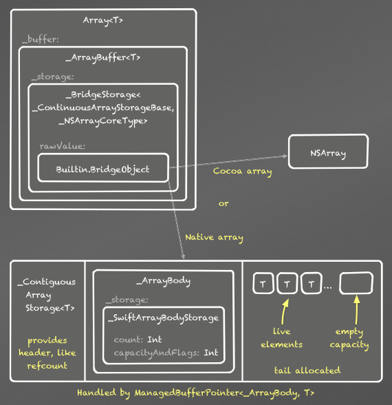
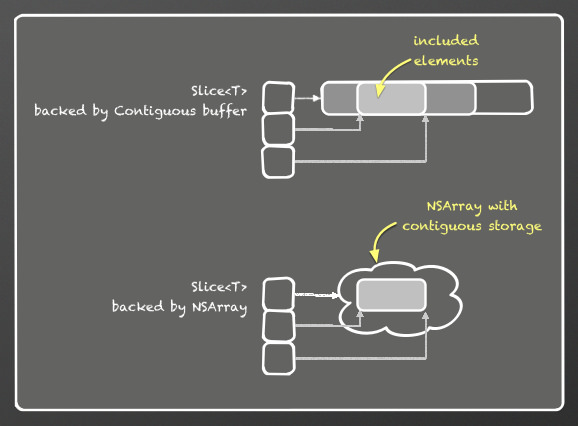

# The Swift Array Design 
Swift에서 Array는 다음과 같은 목표를 가진다.
1. C 배열과 같은 성능을 가진다.
2. Cocoa에 NSArray로 전달시 O(1)이어야 하며, 별도의 메모리 할당이 없어야 한다.
3. 배열을 스택처럼 사용해야 한다.

## 구성 요소
Swift에서 Array는 클래스 타입과 클래스가 아닌 타입을 지원한다. Swift는 ContiguousArray를 가지는데 C 배열 성능이 필요할 때 사용한다. ContiguousArray는 요소가 항상 연속으로 저장되며, Array가 클래스가 아닌 타입을 사용할 때 ContiguousArray와 성능이 동일하다.

Array는 Cocoa를 오가는 효율적인 전환을 위해 최적화 되었다. 클래스 타입일 때 완전히 연속적으로 요소를 저장하지는 않고, NSArray에 저장한다.

ArraySlice는 Array 또는 ContiguousArray의 일부분이며, 배열 a에서의 a[10…20]과 같다. ArraySlice는 항상 연속적인 저장 공간과 C 배열과 같은 성능을 가진다. ArraySlice는 일시적인 계산에 사용하는데 추천하며, ArraySlice 수명을 길게 늘이는 것을 권장하지 않는다. 이는 공유 백업 버퍼의 일부분을 참조하고 있기 때문이다.

## Array 타입 변환
* 클래스 타입이거나 @objc 타입의 Array는 NSArray로 변환시 O(1)
* NSArray에서 Array로 변환시 NSArray에서 O(1)과 copy() 호출 비용
* [T]에서 [U]로 타입 전환시 O(1)
* [T]에서 [U]?로 전환 확인시 O(N)
-------------------------------------------------
[출처](https://github.com/apple/swift/blob/master/docs/Arrays.rst)