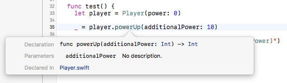
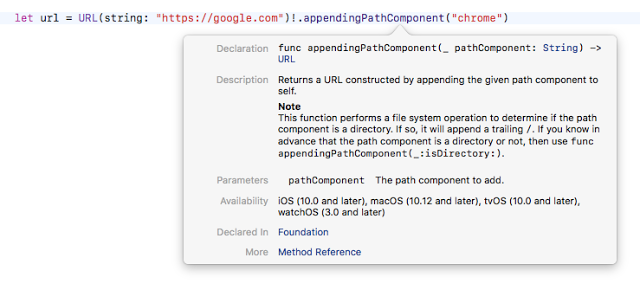
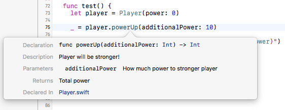
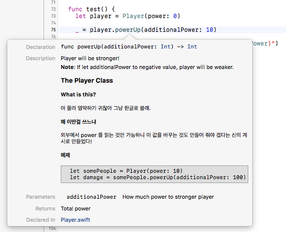

# Swift Documentation - 스위프트 코드 기반 문서화 
이번에 소개할 주제는 코드 자동 문서화에 대한 것이다. 별도의 레퍼런스 매뉴얼로 만들어 내는 것 보다는 Xcode 내에서 참조 할 때 표시되는 도움말 팝업 위주이다.

이 글은 소스 코드 문서화에 대한 전반적인 내용을 다루지는 않는다. 간단한 예제를 통해 쓰는 방법을 유도하는 튜토리얼 수준의 내용이다.

우선 예제로 아래 소스코드가 있다고 치자. 

```Swift
class Player {

  private var power: Int = 0
  
  var currentPower: Int {
    return power
  }
  
  init(power: Int) {
    self.power = power
  }
  
  func powerUp(additionalPower: Int) -> Int {
    power += additionalPower
    return power
  }
  
  func powerDown(decrementalPower: Int) -> Int {
    power -= decrementalPower
    return power
  }
  
}
```
여기서는 마치 게임 데이터용인 듯한 Player 라는 클래스를 정의하고 있다. 
이제 이 클래스를 다른 곳에서 쓸 때 Xcode 상에서 옵션키를 누른 채로 해당 문자열을 클릭하면 클래스나 메소드의 레페런스 도움말 팝업을 볼 수 있다.



Xcode 가 자동으로 알려주는 이 도움말 팝업에는 메소드 등의 원형 정도를 알려준다. 본인이 작성한 클래스라면 이 정도 만으로도 정보는 충분할 것이다.

하지만 자신이 작성한 클래스를 남이 사용하게 되는 경우라면 위와 같은 내용은 상당히 불친절할 수 밖에 없다. 겨우 원형 정도를 알려주는 정도일 뿐이니 말이다.

기존 파운데이션에서 제공되는 클래스의 문서 모양과 살짝 비교해보자.

위 스크린샷은 URL(NSURL) 의 appendingPathComponent 메소드의 레퍼런스 팝업이다. 보다싶이 굉장히 상세한 내용들이 표시된다. 용도가 무엇인지, 입력하는 파라미터는 무엇이고 등등 말이다.

> 사실 위 예제의 코드는 잘못된 사용을 가정하고 있다. 위 팝업의 Note 내용을 잘 보면 알 수 있다. appendingPathComponent 는 파일 시스템 경로를 만들 때나 쓰는 메소드이기 때문이다.

이 정도 수준의 레퍼런스 도움말 팝업은 어떻게 하면 얻을 수 있을까.

답은 **주석(Comment)문** 이다. 주석문이 코드 읽기에 도움이 되는 메모를 남기기 위한 용도로만 존재하는건 아니다. 사실 오래전부터 주석문은 레퍼런스 매뉴얼의 일종이기도 했으니까.

## 예제
아래는 Player 클래스의 powerUp 메소드에 이런 레퍼런스 도움말을 작성하기 위한 주석 예제이다. 

```Swift
/**
 Player will be stronger!
  
 - parameter additionalPower: How much power to stronger player
   
 - returns: Total power
 */
func powerUp(additionalPower: Int) -> Int {
  power += additionalPower
  return power
}
```
이렇게 주석문을 추가한 후 powerUp 이 쓰이는 곳을 옵션 클릭을 하게 되면 이제 바뀐 팝업을 볼 수 있다.



기존에는 없던 Description 이라던가 Parameters, Returns 등의 내용이 추가되어서 보인다. 내용이 적어서 좀 단순해 보이지만 필요한 내용은 잘 알려주고 있는 것 같다.

문서화의 가장 기초적인 점은 주석의 모양이다. 특히 문서화용 주석은 일반 주석과 구분하기 위해 아래와 같은 특정한 방식으로 적어야 한다. 

```
/**
 문서화 내용
 ...
 */

혹은

/// 문서화 내용
/// ...
```
그 외에 여기서는 parameter 라는 항목만 주의깊에 보면 나머지는 단순하다. parameter 의 경우 이 다음에 파라미터 이름을 정확하게 명시한 뒤 콜론(:)을 표기하고 그 이후에 설명을 붙이고 있다. 그리고 파라미터가 두 개 이상이라면 연달아 적어야 할 것이다. 아래 처럼 말이다.
```
- parameter someParamA: This is parameter for A
- parameter someParamB: This is parameter for B
```

### 마크다운(Markdown)으로 꾸며보기
Xcode 자체에서 풀 마크다운을 지원하는지 아니면 비슷한 문법을 제공하는지는 모르겠지만, 일단 일부 마크다운(Markdown) 문법을 이용해 문서를 꾸미는 것(Mark-up)도 가능하다. 아래의 예제에는 주석문 전체에서 마크다운 문법을 이용하고 있다. 
```Swift
/**
 Player will be stronger!
 
 **Note**: If let additionalPower to negative value, player will be weaker.
   
 # The Player Class
   
 ## What is this?
   
 아 몰라 영약하기 귀찮아 그냥 한글로 쓸래.
   
 ## 왜 이딴걸 쓰느냐
   
 외부에서 power 를 읽는 것만 가능하니 이 값을 바꾸는 것도 만들어 줘야 겠다는 *신의 계시*로 만들었다!
   
 ## 예제
   
 ```
   let somePeople = Player(power: 10)
   let damage = somePeople.powerUp(additionalPower: 100)
 ```
   
 - parameter additionalPower: How much power to stronger player
   
 - returns: Total power
 */
func powerUp(additionalPower: Int) -> Int {
  power += additionalPower
  return power
}
```

이렇게 작성한 뒤 레퍼런스 도움말 팝업을 열어보면 아래처럼 보인다.



[출처](http://seorenn.blogspot.kr/2017/01/swift-documentation.html)


